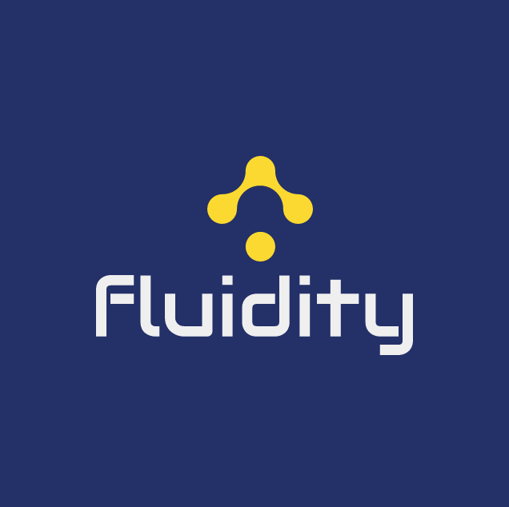

[](https://www.codacy.com/gh/liquidlabsio/fluidity?utm_source=github.com&amp;utm_medium=referral&amp;utm_content=liquidlabsio/fluidity&amp;utm_campaign=Badge_Grade)



The dataflow analytics and visualization platform

# What is it?

A data analytics platform that focuses on events, dataflows (streams of events) and makes them observable.

## In more detail...

It lets you search and analyse streams of events from logfiles (correlation-Ids, txn ids), Kafka or other sources. 
Analysis is both historical (batch) and live (stream) - providing insight on streams are behaving now and in the past. 
Historical analysis provides a baseline for measure performance, data characteristics and more. Perhaps an example is best.
>A payment processing system.<br> 
>>Questions answered:
>1. Volume of transactions processed (rate/sec)
>1. Latency profiling at each stage of a pipeline? i.e. are some processing stages backing up?
>1. Percentile based breakdown and correlation of data attributes versus performance. i.e. Payment amount and Latency
>1. Heatmap overlay of live performance versus historical performance (broken down by hour-of-day, day-of-week etc)

Visual analysis:
* Sankey diagrams: provide segmented understanding over dataflow stages and correlation between latency and data attributes.
* Stream Graphs: time series overlays to see trending, spot outliers.
* Network flow diagrams: node relationships and related traffic.

Functional:
* Historical time series overlay analysis, by time segment (points in time) or overlay (24h overlay)
* Historical time series replay, discover repeatable behavior
* Live streaming overlaid upon historical overlay heatmap (correlated behavior and trend analysis)

Applicability:
* log analysis
* distributed tracing using correlation-ids
* data pipelines via trace identifiers
* event driven microservices via trace identifier, txn identiers, correlation ids.
* serverless function dataflow analysis via trace identifier, txn identifiers, correlation ids.

 
# Technology

Fluidity is written to be CloudFirst and Serverless. The goal is to support large volume data storage using 
cloud storage (Amazon S3) and adhoc compute processing using serverless functions (AWS Lambda).

Data processing is expensive; this tool is meant to be cheap and simple. It provides  
functionality that most people need. 
* upload new data to storage
* import existing storage data
* then enrich data with meta data (i.e. human readable tags)
* find data by the tags and view the raw data
* search, like a distributed grep
* apply stream specific visualizations
* provide time series overlays
* extrapolate data attributes to extract data models for stream visualization (sankey, streamflow, service map)

## Runtime
1. Quarkus: a Java container runtime providing the best of breed tools/frameworks from the Java ecosystem. They compile down to GraalVM - Java-native microkernel without the traditional Java overhead
2. Serverless functions. Using the AWS-Lambda extension, API calls are delegated through the APIGateway (proxy) to call onto a Serverless function instance.
3. Cloud native storage: S3, GFS etc
4. Cloud native database (AWS:DynamoDB)
5. Static web-tier from storage layer (i.e. hosted on S3) and calls to the REST API
 via API Gateway and delegates to the Serverless function. Call-chain complexity is 
 handled by Quarkus extensions (i.e. lambda-http, resteasy etc)

# Building

#### Build and run from source

    $ clone
    $ ./mvnw compile quarkus:dev
    Open index.html in a browser from Intellij (backend.js defaults to http://localhost:8080 which quarkus is running the REST endpoint)


#### Server Mode 

> build and run the GraalVM executable.

#### Cloud - AWS Deployment

Notes and limits: 
- If you want data to load quickly to the browser then enable CORS on each S3 bucket and 
Fluidity will use a signed URL to download directly from S3 (see etc/s3-cors.xml). 
If not enabled, then a signed download be tried, and upon failure revert to using a Lambda.
- The largest browsable file is 100MB before the browser starts to suffer from memory limits (about 250k lines of text) 
The same file will gzip down to 3.6MB and can be handled by a Function call. AWS Function download limits are limited by lambda return limits -  5MB   

Prerequisites: 
- Install AWS SAM: https://docs.aws.amazon.com/serverless-application-model/latest/developerguide/what-is-sam.html
- Install the AWS cli. I used version 2.0 - i.e. all cli commands are `> aws2 --stuff--`
- Create an S3 bucket for the Fluidity cloud runtime (lambda-code, front-end website) deployment (put that name into env.sh) <YOUR_S3_BUCKET>
- Configure the S3 fluidity-runtime bucket for static website hosting
- AWS account for the SAM user such that Cloudformation etc is available. Brute force unsecure json as follows: <br>
    **IAM -> User (x) -> inline-policy ** <BR>
    IAMFullAccess,   AmazonS3FullAccess,  AmazonDynamoDBFullAccess  
    AWSCloudFormationFullAccess,  AmazonAPIGatewayAdministrator, AWSLambdaFullAccess

```json
{
    "Version": "2012-10-17",
    "Statement": [
        {
            "Sid": "VisualEditor0",
            "Effect": "Allow",
            "Action": [
                "iam:*",
                "apigateway:*",
                "lambda:*",
                "cloudformation:*",
                "dynamodb:*"
            ],
            "Resource": "*"
        }
    ]
}
```

#### Scripted
1. $ cd fluidity/etc
1. edit env.sh with S3 bucket, tenant information etc
1. $ ./deploy-backend.sh
1. edit env.sh with APIGateway address
1. $ ./deploy-frontend.sh 
1. S3 cp generally fails so change to ./temp-web-package and 'aws2 s3 cp . s3://<BUCKET> --recurvise' files again
1. Point your browser to the URL in this message 'Point your browser to:'
1. Username:anything@fluidity.io pwd: 'secret'

##### Troubleshooting
1. Check the deployment user has correct permissions - error message will indicate so
1. Check the aws2 s3 cp to the runtime bucket worked. If it partially failed the browser debug console will show resources failed to load or endpoints are not correct (failed to connect to address)
1. Rollback using the cloudformation console

#### Manual

Reference: https://quarkus.io/guides/amazon-lambda-http

**Notes:**
This approach uses the AWS Gateway Proxy (i.e. the Gateway passes through everything). Quarkus has a HTTP handler embedded in the Lambda the calls on the RX Rest endpoint locally.
1. Create the fluidity fat jar <br>
 `$ mvn clean install` ->
 `target/fluidity-0.1-SNAPSHOT-runner.jar`<br>
1. Package the deployment:<br>
 `$ sam package --template-file sam.jvm.yaml --output-template-file packaged.yaml --s3-bucket <YOUR_S3_BUCKET>`
1. Deploy it using any stack-name<br>
`$ sam deploy --template-file packaged.yaml --capabilities CAPABILITY_IAM --stack-name <YOUR_STACK_NAME>`<br>
The output will display the API-Gateway URL for the front end

1. List deployments looking for your stack (and others)<br>
`$ aws2 cloudformation list-stacks`<br>
> to delete: 
> `$ aws2 cloudformation delete-stack --stack-name <YOUR_STACK_NAME>`

```json
 { "StackSummaries": [
        {
            "StackId": "arn:aws:cloudformation:eu-west-2:001814218767:stack/fluidity-faas/6a5712b0-3d2f-11ea-8738-021679f87d94",
            "StackName": "fluidity-faas",
            "TemplateDescription": "AWS Serverless Quarkus HTTP - liquidlabs::fluidity",
            "CreationTime": "2020-01-22T15:54:04.530000+00:00",
            "LastUpdatedTime": "2020-01-22T15:54:09.927000+00:00",
            "StackStatus": "CREATE_COMPLETE",
            "DriftInformation": {
                "StackDriftStatus": "NOT_CHECKED"
            }
        }
    ]
}
```
1. Note the API-Gateway-Proxy REST URL<br>
`$ aws2 cloudformation describe-stacks --stack-name fluidity-faas`
```json
{
    "Stacks": [
        {
            "StackId": "arn:aws:cloudformation:eu-west-2:001814218767:stack/fluidity-faas/6a5712b0-3d2f-11ea-8738-021679f87d94",
            "StackName": "fluidity-faas",
            "ChangeSetId": "arn:aws:cloudformation:eu-west-2:001814218767:changeSet/samcli-deploy1579708443/2f0ce821-122f-40b5-ad6f-26861bc64daf",
            "Description": "Serverless log analysis- liquidlabs::fluidity",
            "CreationTime": "2020-01-22T15:54:04.530000+00:00",
            "LastUpdatedTime": "2020-01-22T15:54:09.927000+00:00",
            "RollbackConfiguration": {},
            "StackStatus": "CREATE_COMPLETE",
            "DisableRollback": false,
            "NotificationARNs": [],
            "Capabilities": [
                "CAPABILITY_IAM"
            ],
            "Outputs": [
                {
                    "OutputKey": "FluidityApi",
                    "OutputValue": "https://3dwlmgnks6.execute-api.eu-west-2.amazonaws.com/Prod/",
                    "Description": "URL for application",
                    "ExportName": "FluidityApi"
                }
            ],
            "Tags": [],
            "EnableTerminationProtection": false,
            "DriftInformation": {
                "StackDriftStatus": "NOT_CHECKED"
            }
        }
    ]
}
```
1. From above see that the API-Gateway Proxy is available on <br>
`https://3dwlmgnks6.execute-api.eu-west-2.amazonaws.com/Prod/`
1. Check the API Gateway proxies requests to the Lambda function - **Note - append** `query/id` to the url. It will suffer a cold start, but subsequent invocations will be much quicker
 
```
Browser URL: https://3dwlmgnks6.execute-api.eu-west-2.amazonaws.com/Prod/query/id
Response:    QueryResource
```
1. Configure the User interface URL to point to the API-Gateway address
